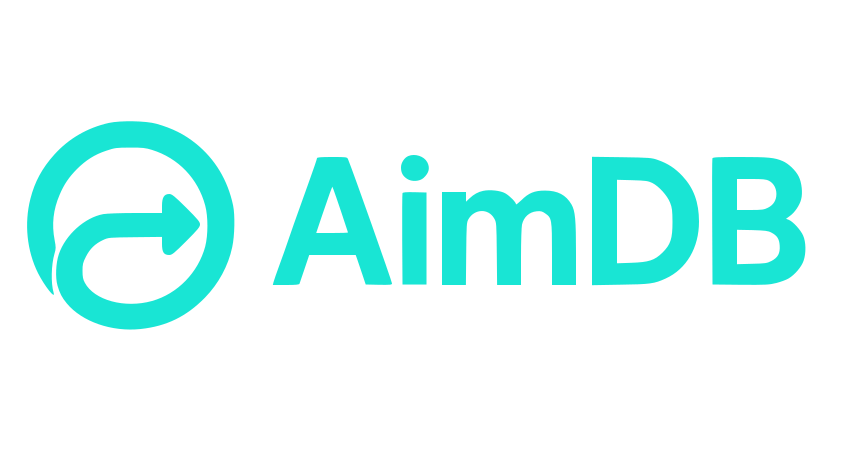
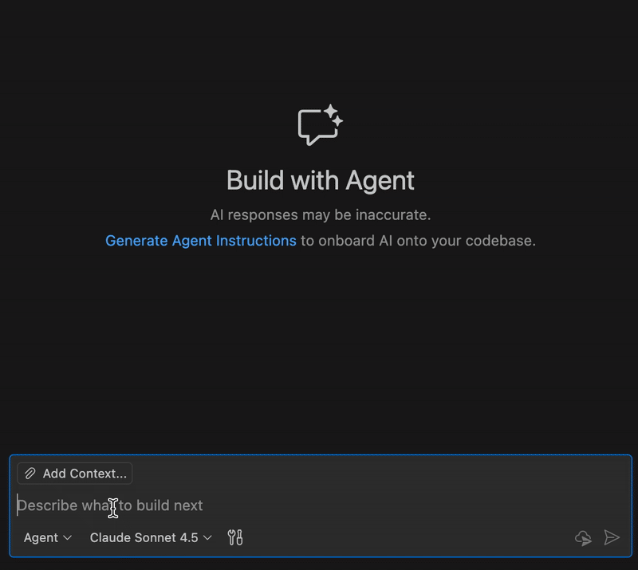

<p align="center">
  <picture>
    <source media="(prefers-color-scheme: dark)" srcset="assets/aimdb-logo.svg">
    <source media="(prefers-color-scheme: light)" srcset="assets/aimdb-logo.svg">
    
  </picture>
</p>
<p align="center">
    <strong>Dataflow engine for distributed systems.</strong><br>
    <strong>MCU to Cloud. Same API.</strong>
</p>
<p align="center">
<a href="https://github.com/aimdb-dev/aimdb/stargazers/" target="_blank">
    
</a>
<a href="https://github.com/aimdb-dev/aimdb/releases" target="_blank">
    
</a>
<a href="https://crates.io/crates/aimdb-core" target="_blank">
    
</a>
<a href="https://github.com/aimdb-dev/aimdb/actions/workflows/ci.yml" target="_blank">
    
</a>
<a href="LICENSE" target="_blank">
    
</a>
</p>

Write your data pipeline once. Run it on microcontrollers, edge gateways or Kubernetes — no code changes. AimDB's portable data contracts handle serialization, transforms and schema evolution across all runtimes.

<p align="center">
  
</p>

---

### Getting Started

**See it live** — explore a running sensor mesh at [aimdb.dev](https://aimdb.dev)

<p align="center">
  <a href="https://aimdb.dev">
    
  </a>
</p>

**Run locally** — full MCU → edge → cloud mesh in Docker:

```bash
cd examples/weather-mesh-demo
docker compose up
```

Then ask VS Code Copilot: *"What's the current temperature from station ...?"* ([MCP setup required](examples/weather-mesh-demo/))

<p align="center">
  
</p>

**Learn more:**
- [Quick Start Guide](https://aimdb.dev/docs/getting-started) — Dependency setup and API basics
- [Data Contracts](https://aimdb.dev/docs/data-contracts) — Type-safe schemas
- [Connectors](https://aimdb.dev/docs/connectors) — MQTT, KNX and more
- [Deployment](https://aimdb.dev/docs/deployment) — Running on MCU, edge and cloud
- [API Reference](https://docs.rs/aimdb-core) — Full Rust API documentation

---

### Why AimDB?

A real-time data runtime that adapts to your infrastructure, not the other way around.

| Problem | AimDB Solution |
|---------|----------------|
| **Runs Where Data Starts** | From $2 MCUs to Kubernetes clusters. Deploy the same code anywhere, process data at the source. |
| **Same API Everywhere** | Tokio + Embassy compatible, embedded-friendly, `no_std`-ready. One interface across all your runtimes. |
| **Built for Continuous Change** | Unified data layer with schema evolution built in. Your data pipelines adapt as fast as your business. |

---

### Connectors

| Protocol | Crate | Status | Runtimes |
|----------|-------|--------|----------|
| **MQTT** | `aimdb-mqtt-connector` | ✅ Ready | std, no_std |
| **KNX** | `aimdb-knx-connector` | ✅ Ready | std, no_std |
| **HTTP/REST** | — | 🔨 Building | std |
| **Kafka** | — | 📋 Planned | std |
| **Modbus** | — | 📋 Planned | std, no_std |

---

### Platform Support

| Target | Runtime | Features | Footprint |
|--------|---------|----------|-----------|
| **ARM Cortex-M** (STM32H5, STM32F4) | Embassy | no_std, async | ~50KB+ |
| **ARM Cortex-M** (STM32H5, STM32F4) | FreeRTOS | 📋 Planned | — |
| **Linux Edge Devices** | Tokio | Full std | ~10MB+ |
| **Containers/K8s** | Tokio | Full std | ~10MB+ |

---

### Contributing

Found a bug or want a feature? Open a [GitHub issue](https://github.com/aimdb-dev/aimdb/issues).

Have questions or ideas? Join the discussion on [GitHub Discussions](https://github.com/aimdb-dev/aimdb/discussions).

Want to contribute? See the [contributing guide](CONTRIBUTING.md). We have [good first issues](https://github.com/aimdb-dev/aimdb/labels/good-first-issue) to get started.

---

### License

[Apache 2.0](LICENSE)

---

<p align="center">
  <strong>Write once. Deploy anywhere. Pay only where it makes sense.</strong>
</p>
