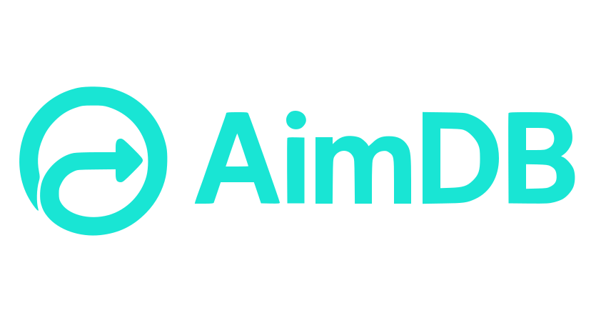
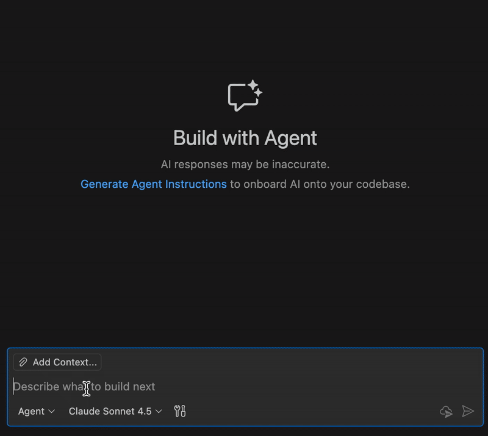

<p align="center">
  
</p>
<p align="center">
    <strong>Distributed by design. Data-driven by default.</strong>
</p>
<p align="center">
<a href="https://github.com/aimdb-dev/aimdb/stargazers/" target="_blank">
    
</a>
<a href="https://github.com/aimdb-dev/aimdb/releases" target="_blank">
    
</a>
<a href="https://crates.io/crates/aimdb-core" target="_blank">
    
</a>
<a href="https://github.com/aimdb-dev/aimdb/actions/workflows/ci.yml" target="_blank">
    
</a>
<a href="LICENSE" target="_blank">
    
</a>
</p>

AimDB turns data contracts into the architecture. Define your schemas once and deploy them unchanged across microcontrollers, edge gateways, Kubernetes and the browser.

[](https://aimdb.dev)

> **[See it running →](https://aimdb.dev)** Live weather stations streaming typed contracts across MCU, edge and cloud.

---

## Why AimDB exists

AimDB makes **the Rust type the contract** — defined once, compiled unchanged from a `no_std` microcontroller to a Kubernetes pod. No separate schema files. No code generators. No translation layer between firmware and cloud. The code is law.

- **One type, every tier** — the same struct compiles for bare-metal firmware and a cloud service, with no conversion layer between them.
- **No glue code between layers** — the buffer type on a record defines how it moves. No manual queue wiring.
- **Observability built-in** — implement the `Observable` trait and every record emits metrics automatically. No separate instrumentation layer.
- **Connectors derive from the type** — declare a connector on the key, not as a separate process.

→ [The Next Era of Software Architecture Is Data-First](https://aimdb.dev/blog/data-driven-design)

---

## Quick start

### Run it locally in 5 min

```bash
cargo new my-aimdb-app && cd my-aimdb-app
cargo add aimdb-core aimdb-tokio-adapter tokio --features tokio/full
```

Drop this into `src/main.rs`:

```rust
use aimdb_core::{buffer::BufferCfg, AimDbBuilder};
use aimdb_tokio_adapter::{TokioAdapter, TokioRecordRegistrarExt};
use std::sync::Arc;

#[derive(Clone, Debug)]
pub struct Temperature {
    pub celsius: f32,
}

#[tokio::main]
async fn main() -> Result<(), Box<dyn std::error::Error>> {
    let runtime = Arc::new(TokioAdapter::new()?);
    let mut builder = AimDbBuilder::new().runtime(runtime);

    builder.configure::<Temperature>("temp.indoor", |reg| {
        reg.buffer(BufferCfg::SpmcRing { capacity: 16 })
            .source(|ctx, producer| async move {
                for celsius in [21.0, 22.5, 24.1] {
                    producer.produce(Temperature { celsius }).await.ok();
                    ctx.time().sleep(ctx.time().secs(1)).await;
                }
            })
            .tap(|ctx, consumer| async move {
                let mut reader = consumer.subscribe().unwrap();
                while let Ok(t) = reader.recv().await {
                    ctx.log().info(&format!("temp: {:.1}°C", t.celsius));
                }
            })
            .finish();
    });

    builder.build()?.run().await?;
    Ok(())
}
```

`cargo run` — three temperature readings stream through a typed pipeline. The same code compiles for Embassy on a Cortex-M4 or WASM in the browser by swapping the runtime adapter — nothing else changes.

### Run a real weather mesh in less than 30 min

A full MCU → edge → cloud mesh: three weather stations, MQTT broker and a central hub.

```bash
git clone https://github.com/aimdb-dev/aimdb
cd aimdb/examples/weather-mesh-demo
docker compose up
```

→ [Walkthrough in the docs](https://aimdb.dev/docs/getting-started)

---

## What you get

- **One async API across MCU, edge, cloud and browser.** Tokio, Embassy, WASM — same code, different runtime adapter. → [How the runtime abstraction works](https://aimdb.dev/blog/building-aimdb-one-async-api)
- **Typed Rust structs are the schema.** No IDL, no codegen step, no schema registry.
- **Three buffer primitives** that cover most data-movement patterns:

| Buffer | Semantics | Use cases |
| --- | --- | --- |
| **SPMC Ring** | Bounded stream with independent consumers | Sensor telemetry, event logs |
| **SingleLatest** | Only the current value matters | Feature flags, config, UI state |
| **Mailbox** | Latest instruction wins | Device commands, actuation, RPC |

- **Capabilities are unlocked by traits.** Implement `Streamable` to cross WASM/WebSocket/CLI boundaries, `Migratable` for typed schema evolution, `Observable` for monitoring, `Linkable` for wire-format connectors. Without the trait, the type system says no.
- **Connectors that ship today:** MQTT, KNX, WebSocket. Writing your own is one trait impl.

→ Deep dives: [data contracts](https://aimdb.dev/blog/data-contracts-deep-dive) · [source/tap/transform](https://aimdb.dev/blog/source-tap-transform) · [schema migration](https://aimdb.dev/blog/schema-migration-without-ceremony) · [reactive pipelines](https://aimdb.dev/blog/reactive-pipelines)

---

### Platform-Agnostic by Design

The same contract works across all runtimes without modification:

```
┌───────────────────────────────────────────────────────────────────────────────┐
│                           Temperature Contract                                │
├───────────────────┬───────────────────┬───────────────────┬───────────────────┤
│  MCU (Embassy)    │  Edge (Tokio)     │  Cloud (Tokio)    │  Browser (WASM)   │
│  no_std + alloc   │  std              │  Kubernetes       │  wasm32           │
│  Cortex-M4        │  Linux / RPi      │  Full featured    │  Single-threaded  │
└───────────────────┴───────────────────┴───────────────────┴───────────────────┘
```

The Rust type system enforces correctness at compile time. The dataflow engine's buffer semantics enforce flow guarantees at runtime. Connectors wire everything to your infrastructure without an integration layer.

---

## Ask your AI about your running system

AimDB ships an MCP server. Point any MCP-compatible client at a running instance and query it in natural language.

[](assets/copilot-communication.gif)

Try it against the live demo — no install required. Add this to your workspace:

`.vscode/mcp.json`:

```json
{
  "servers": {
    "aimdb-weather": {
      "type": "http",
      "url": "http://aimdb.dev/mcp"
    }
  }
}
```

Then ask: *"What's the current temperature in Munich?"*

See the [MCP server docs](tools/aimdb-mcp/) for Claude Desktop and other editors or read the deep dive: [AI-Assisted System Introspection: AimDB Meets the Model Context Protocol](https://aimdb.dev/blog/ai-introspection-with-mcp).

---

## Learn more

- [Quick Start Guide](https://aimdb.dev/docs/getting-started) — dependencies, platform setup, your first contract
- [API reference (docs.rs)](https://docs.rs/aimdb-core) — full Rust API
- [Blog](https://aimdb.dev/blog) — design notes, deep dives, release write-ups
- [Live demo](https://aimdb.dev) — running sensor mesh

---

### Connectors

| Protocol | Crate | Status | Runtimes |
|----------|-------|--------|----------|
| **MQTT** | `aimdb-mqtt-connector` | ✅ Ready | std, no_std |
| **KNX** | `aimdb-knx-connector` | ✅ Ready | std, no_std |
| **WebSocket** | `aimdb-websocket-connector` | ✅ Ready | std, wasm |
| **Kafka** | — | 📋 Planned | std |
| **Modbus** | — | 📋 Planned | std, no_std |

---

### Platform Support

| Target | Runtime | Adapter | Features | Footprint |
|--------|---------|---------|----------|-----------|
| **ARM Cortex-M** (STM32H5, STM32F4) | Embassy | `aimdb-embassy-adapter` | no_std, async | ~50KB+ |
| **Linux Edge** (RPi, gateways) | Tokio | `aimdb-tokio-adapter` | Full std | ~10MB+ |
| **Containers / K8s** | Tokio | `aimdb-tokio-adapter` | Full std | ~10MB+ |
| **Browser / SPA** | WASM | `aimdb-wasm-adapter` | wasm32, single-threaded | ~2MB+ |

---

## Contributing

Found a bug or want a feature? Open a [GitHub issue](https://github.com/aimdb-dev/aimdb/issues).

Have questions or ideas? Join the discussion on [GitHub Discussions](https://github.com/aimdb-dev/aimdb/discussions).

Want to contribute? See the [contributing guide](CONTRIBUTING.md). We have [good first issues](https://github.com/aimdb-dev/aimdb/labels/good-first-issue) to get started.

---

## License

[Apache 2.0](LICENSE)

---

<p align="center">
  <strong>Define once. Deploy anywhere. Observe everything.</strong>
  <br><br>
  <a href="https://aimdb.dev/docs/getting-started">Get started</a> · <a href="https://aimdb.dev">Live demo</a> · <a href="https://github.com/aimdb-dev/aimdb/discussions">Join the discussion</a>
</p>
