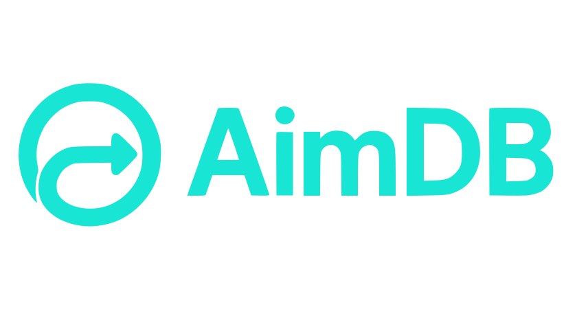

<p align="center">
  
</p>

<p align="center"><strong>Distributed by design. Data-driven by default.</strong></p>

<p align="center">
AimDB is the data ingestion layer for distributed systems: typed contracts, safe schema evolution and one place to see and manage every node. From microcontroller to cloud.
</p>

<p align="center">
  <a href="https://github.com/aimdb-dev/aimdb/stargazers"></a>
  <a href="https://github.com/aimdb-dev/aimdb/releases"></a>
  <a href="https://crates.io/crates/aimdb-core"></a>
  <a href="https://www.npmjs.com/package/@aimdb/aimdb-wasm-adapter"></a>
  <a href="https://github.com/aimdb-dev/aimdb/actions/workflows/ci.yml"></a>
  <a href="LICENSE"></a>
</p>

<p align="center">
  <a href="https://aimdb.dev">Live demo</a> ·
  <a href="https://aimdb.dev/docs/getting-started">Get started</a> ·
  <a href="#use-it-from-your-language">Python, C++, TypeScript</a> ·
  <a href="https://github.com/aimdb-dev/aimdb/discussions">Discussions</a>
</p>

## The problem

Every distributed system has an ingestion layer and it is usually the most fragile part.

- **Formats drift.** A firmware team renames a field and the dashboard goes quiet three days later.
- **Fleets never update at once.** Devices in the field run last year's firmware next to this week's release.
- **Nobody has the full picture.** Which device sends what, in which version, over which link, lives in people's heads and old wiki pages.

AimDB makes that layer explicit, typed and versioned.

## How AimDB solves it

| | What you get | Built on |
| --- | --- | --- |
| **Stable** | Every record has a typed contract. Producers and consumers can't disagree about the shape of the data. | `SchemaType`, compile-time checks |
| **Evolvable** | Old and new nodes run side by side. The hub upgrades v1 payloads to v2 on arrival and can downgrade for older peers. | `migration_chain!`, works `no_std` |
| **Centrally managed** | One shared contracts crate defines every record, key and link. The same CLI or AI client inspects and manages any node, from the cloud hub to an MCU on a serial port. | `RecordKey`, `aimdb` CLI, MCP server |

[](https://aimdb.dev)

> **[See it running](https://aimdb.dev):** live weather stations streaming typed contracts across MCU, edge and cloud.

## See it in three steps

### 1. Define the fleet's contracts once

One `no_std` crate holds every contract and record key. Stations, hub and dashboard all compile against it, so they can't disagree.

```rust,ignore
#[derive(Clone, Debug, Serialize, Deserialize)]
pub struct TemperatureV2 {
    pub schema_version: u32,
    pub celsius: f32,
    pub timestamp: u64,
}

impl SchemaType for TemperatureV2 {
    const NAME: &'static str = "temperature";
    const VERSION: u32 = 2;
}

#[derive(RecordKey, Clone, Copy, PartialEq, Eq, Debug)]
#[key_prefix = "temp."]
pub enum TempKey {
    #[key = "alpha"]
    #[link_address = "mqtt://sensors/alpha/temperature"]
    Alpha,
    #[key = "beta"]
    #[link_address = "mqtt://sensors/beta/temperature"]
    Beta,
}
```

### 2. Evolve a contract without a flag day

v1 stations sent `temp` plus a `unit`. v2 sends `celsius`. Write the step once:

```rust,ignore
impl MigrationStep for TemperatureV1ToV2 {
    type Older = TemperatureV1;
    type Newer = TemperatureV2;
    const FROM_VERSION: u32 = 1;
    const TO_VERSION: u32 = 2;

    fn up(v1: TemperatureV1) -> Result<TemperatureV2, MigrationError> {
        let celsius = match v1.unit.as_str() {
            "F" => (v1.temp - 32.0) * 5.0 / 9.0,
            "K" => v1.temp - 273.15,
            _ => v1.temp,
        };
        Ok(TemperatureV2 { schema_version: 2, celsius, timestamp: v1.timestamp })
    }

    fn down(v2: TemperatureV2) -> Result<TemperatureV1, MigrationError> {
        Ok(TemperatureV1::new(v2.celsius, v2.timestamp, "C"))
    }
}

migration_chain! {
    type Current = TemperatureV2;
    version_field = "schema_version";
    steps { TemperatureV1ToV2: TemperatureV1 => TemperatureV2 }
}
```

The chain is validated at compile time and runs on a microcontroller too. Full example: [`weather-mesh-common`](examples/weather-mesh-demo/weather-mesh-common/src/contracts/temperature.rs).

### 3. Manage every node from one place

The same `aimdb` CLI talks to the hub over TCP and to a microcontroller over a serial port:

```bash
aimdb --connect tcp://hub.local:7001 record list      # every record, with live values
aimdb --connect tcp://hub.local:7001 graph dot | dot -Tsvg > fleet.svg
aimdb --connect serial:///dev/ttyACM0?baud=115200 record list
```

Or point an AI client at the built-in [MCP server](tools/aimdb-mcp/) and ask: *"What is the current temperature at station alpha?"*

## Use it from your language

| Language | How | Where |
| --- | --- | --- |
| **Rust** | Native: `aimdb-core` plus a runtime adapter (Tokio, Embassy, WASM) | [crates.io](https://crates.io/crates/aimdb-core) |
| **Python** | pyo3 bindings | [`weather-station-py`](https://github.com/aimdb-dev/aimdb-weather-mesh) |
| **C / C++** | C ABI | [`weather-station-cpp`](https://github.com/aimdb-dev/aimdb-weather-mesh) |
| **TypeScript / browser** | `npm i @aimdb/aimdb-wasm-adapter` | [npm](https://www.npmjs.com/package/@aimdb/aimdb-wasm-adapter) |

## Quick start

### Your first typed pipeline in 5 minutes

```bash
cargo new my-aimdb-app && cd my-aimdb-app
cargo add aimdb-core aimdb-tokio-adapter
cargo add tokio --features full
```

```rust
use aimdb_core::{buffer::BufferCfg, AimDbBuilder};
use aimdb_tokio_adapter::{TokioAdapter, TokioRecordRegistrarExt};
use std::sync::Arc;

#[derive(Clone, Debug)]
pub struct Temperature {
    pub celsius: f32,
}

#[tokio::main]
async fn main() -> Result<(), Box<dyn std::error::Error>> {
    let runtime = Arc::new(TokioAdapter::new()?);
    let mut builder = AimDbBuilder::new().runtime(runtime);

    builder.configure::<Temperature>("temp.indoor", |reg| {
        reg.buffer(BufferCfg::SpmcRing { capacity: 16 })
            .source(|ctx, producer| async move {
                let time = ctx.time();
                for celsius in [21.0, 22.5, 24.1] {
                    producer.produce(Temperature { celsius });
                    time.sleep_secs(1).await;
                }
            })
            .tap(|ctx, consumer| async move {
                let mut reader = consumer.subscribe();
                while let Ok(t) = reader.recv().await {
                    ctx.log().info(&format!("temp: {:.1}°C", t.celsius));
                }
            });
    });

    // Build the db and drive every source/tap future until shutdown.
    builder.run().await?;
    Ok(())
}
```

### A real fleet in 30 minutes

Three weather stations, an MQTT broker and a central hub:

```bash
git clone https://github.com/aimdb-dev/aimdb
cd aimdb/examples/weather-mesh-demo
docker compose up
```

[Walkthrough in the docs](https://aimdb.dev/docs/getting-started)

## Runs where your data is

| Tier | Runtime | Adapter | Footprint |
| --- | --- | --- | --- |
| Microcontrollers (Cortex-M) | Embassy, `no_std` | `aimdb-embassy-adapter` | ~50 KB+ |
| Edge gateways (Linux, RPi) | Tokio | `aimdb-tokio-adapter` | ~10 MB+ |
| Containers / Kubernetes | Tokio | `aimdb-tokio-adapter` | ~10 MB+ |
| Browser | WASM | `aimdb-wasm-adapter` | ~2 MB+ |

**Connectors today:** MQTT · KNX · WebSocket · TCP · Serial · Unix sockets. Kafka and Modbus are planned. A new connector is one trait impl.

## Under the hood

- **The Rust type is the contract.** No IDL, no schema registry. CI cross-compiles the same contracts from Cortex-M to WASM. → [Data contracts](https://aimdb.dev/blog/data-contracts-deep-dive)
- **Buffers decide how data moves.** SPMC Ring for streams, SingleLatest for state, Mailbox for commands. Zero allocations per message, [measured](aimdb-bench/data/baselines). → [Buffers](https://aimdb.dev/docs/getting-started)
- **Optional persistence.** `.persist()` with a SQLite backend keeps history across restarts. → [`aimdb-persistence`](aimdb-persistence)

## Proven in the open

- **A fleet that runs in public.** [aimdb.dev](https://aimdb.dev) streams live weather stations through microcontroller, edge and cloud nodes, all built on this repository.
- **Migrations are tested both ways.** [Round-trip tests](aimdb-data-contracts/tests/migration_roundtrip.rs) cover upgrade and downgrade across multi-step chains.
- **Same behaviour on every runtime.** A [shared conformance suite](aimdb-core/src/buffer/test_support.rs) runs every buffer on Tokio, Embassy and WASM.
- **Performance is measured.** Per-message [allocation baselines](aimdb-bench/data/baselines) for Tokio, Embassy and WASM are committed to the repo.

## Contributing

Good first issues are sized for a few hours and come with file pointers and acceptance criteria: [see the list](https://github.com/aimdb-dev/aimdb/labels/good%20first%20issue). Comment on an issue to take it; we respond within a day.

Using AimDB somewhere? [Tell us about it](https://github.com/aimdb-dev/aimdb/discussions). We'd love to feature your project.

Questions and ideas: [Discussions](https://github.com/aimdb-dev/aimdb/discussions) · Build and style rules: [CONTRIBUTING.md](CONTRIBUTING.md) · Release notes: [newsletter](https://buttondown.com/aimdb)

## License

[Apache 2.0](LICENSE)

---

<p align="center"><strong>Distributed by design. Data-driven by default.</strong></p>
