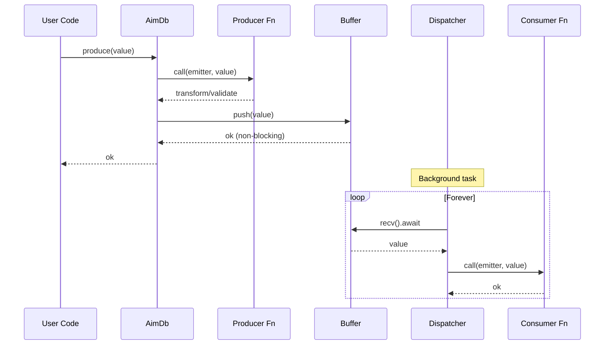

# Design Document: Pluggable Per-Record Buffers

**Status:** ✅ Implemented  
**Author:** AimDB Team  
**Date:** October 11, 2025  
**Issue:** [#27](https://github.com/aimdb-dev/aimdb/issues/27)  
**Milestone:** M1 - Core Features  

---

## Executive Summary

This design introduces pluggable buffering per record type in AimDB, allowing each record to choose between SPMC ring (bounded backlog), SingleLatest (only newest value) or Mailbox (single-slot overwrite) semantics. This enables tailoring delivery guarantees for different data flow patterns (telemetry, configuration, commands) while maintaining the existing type-addressed architecture and `Emitter` cross-publish support.

**Key Benefits:**
- Different buffering strategies for different data patterns
- Non-blocking producer model with async consumer dispatch
- Per-consumer lag tolerance and overflow handling
- Maintains type safety and existing API ergonomics
- Platform-compatible (Tokio std + Embassy no_std)

---

## Table of Contents

1. [Motivation](#motivation)
2. [Goals & Non-Goals](#goals--non-goals)
3. [Architecture Overview](#architecture-overview)
4. [Detailed Design](#detailed-design)
5. [API Specification](#api-specification)
6. [Runtime Adapters](#runtime-adapters)
7. [Memory & Performance](#memory--performance)
8. [Error Handling](#error-handling)
9. [Migration Path](#migration-path)
10. [Testing Strategy](#testing-strategy)
11. [Future Work](#future-work)
12. [Appendices](#appendices)

---

## Motivation

### Problem Statement

Currently, AimDB's `TypedRecord::produce()` method directly invokes producer and consumer functions in sequence:

```rust
pub async fn produce(&self, emitter: Emitter, val: T) {
    // Call producer
    if let Some(p) = &self.producer {
        p.call(emitter.clone(), val.clone()).await;
    }
    
    // Call all consumers sequentially
    for c in &self.consumers {
        c.call(emitter.clone(), val.clone()).await;
    }
}
```

**Limitations:**
1. **Blocking Producers** - Slow consumers block the producer
2. **No Backlog** - High-frequency data has no buffer
3. **One-Size-Fits-All** - All records use the same immediate delivery model
4. **No Lag Tolerance** - Fast producers overwhelm slow consumers

### Use Cases

Different data flows in AimDB's target environments need different semantics:

| Use Case | Pattern | Required Buffer Type |
|----------|---------|---------------------|
| **High-frequency telemetry** | Sensor streams (100-1000 Hz) | SPMC ring with lag tolerance |
| **Configuration state** | Occasional updates, latest wins | SingleLatest (no backlog) |
| **Commands/triggers** | One-shot events | Mailbox (overwrite if not consumed) |
| **Event logs** | Persistent history | SPMC ring (no drops) |

### Target Environments

- **MCU (Embassy)**: Memory-constrained, bounded buffers, static allocation
- **Edge (Tokio)**: Resource-efficient, dynamic buffers
- **Cloud (Tokio)**: High throughput, large buffers

---

## Goals & Non-Goals

### Goals

✅ **G1**: Pluggable buffer selection per record type  
✅ **G2**: Three buffer types: SPMC ring, SingleLatest, Mailbox  
✅ **G3**: Non-blocking producer model (enqueue vs direct call)  
✅ **G4**: Per-consumer async dispatchers with independent lag handling  
✅ **G5**: Maintain existing `Emitter` cross-record communication  
✅ **G6**: Backward compatible default behavior  
✅ **G7**: Runtime-agnostic design (Tokio + Embassy)  
✅ **G8**: Preserve producer/consumer statistics tracking  

### Non-Goals

❌ **NG1**: Multi-producer support (remains single producer per record)  
❌ **NG2**: Persistent storage or durability guarantees  
❌ **NG3**: Backpressure propagation to producers  
❌ **NG4**: Dynamic buffer reconfiguration after `build()`  
❌ **NG5**: Priority-based consumer scheduling  
❌ **NG6**: Transaction or batching support  

---

## Architecture Overview

### Current Architecture

```
┌─────────────┐
│   Producer  │
│   produce() │
└──────┬──────┘
       │ (await)
       ▼
┌─────────────┐
│  Producer   │◄── TrackedAsyncFn<T>
│  Function   │
└──────┬──────┘
       │ (await)
       ▼
┌─────────────┐
│ Consumer 1  │◄── TrackedAsyncFn<T>
└──────┬──────┘
       │ (await)
       ▼
┌─────────────┐
│ Consumer 2  │◄── TrackedAsyncFn<T>
└─────────────┘

Problem: Sequential, blocking
```

### New Architecture with Buffers

```
┌─────────────┐
│   Producer  │
│   produce() │
└──────┬──────┘
       │ (await producer fn)
       ▼
┌─────────────┐
│  Producer   │◄── TrackedAsyncFn<T>
│  Function   │
└──────┬──────┘
       │ (enqueue - non-blocking)
       ▼
┌─────────────────────┐
│   Buffer<T>         │
│ ┌─────────────────┐ │
│ │ BufferCfg:      │ │
│ │ - SpmcRing      │ │
│ │ - SingleLatest  │ │
│ │ - Mailbox       │ │
│ └─────────────────┘ │
└──┬────────┬────────┬┘
   │        │        │
   │ (subscribe per consumer)
   │        │        │
   ▼        ▼        ▼
┌────┐   ┌────┐   ┌────┐
│ D1 │   │ D2 │   │ D3 │  Dispatchers (async tasks)
└─┬──┘   └─┬──┘   └─┬──┘
  │        │        │
  │ (loop recv + call)
  │        │        │
  ▼        ▼        ▼
┌────┐   ┌────┐   ┌────┐
│ C1 │   │ C2 │   │ C3 │  Consumer functions
└────┘   └────┘   └────┘

Benefits: Async, parallel, lag-tolerant
```

### Component Interaction Flow



---

## Detailed Design

### 1. Buffer Configuration

```rust
/// Buffer configuration for a record type
#[derive(Debug, Clone, PartialEq, Eq)]
#[cfg_attr(feature = "serde", derive(serde::Serialize, serde::Deserialize))]
pub enum BufferCfg {
    /// SPMC (Single Producer, Multiple Consumer) ring buffer
    /// 
    /// # Characteristics
    /// - Bounded capacity with overflow handling
    /// - Each consumer has independent read position
    /// - Fast producer can outrun slow consumer (lag detection)
    /// - Oldest messages dropped on overflow
    /// 
    /// # Use Cases
    /// - High-frequency telemetry (sensor streams)
    /// - Event logs with bounded memory
    /// - Metrics collection
    /// 
    /// # Memory
    /// - `capacity * size_of::<T>()` bytes
    /// - Additional overhead per consumer (~64 bytes)
    SpmcRing { 
        /// Maximum number of items in the buffer
        /// Must be power of 2 for optimal performance
        capacity: usize 
    },
    
    /// Single latest value buffer (no backlog)
    /// 
    /// # Characteristics
    /// - Only the most recent value is kept
    /// - Consumers always see latest state
    /// - Intermediate values are skipped
    /// - No memory accumulation
    /// 
    /// # Use Cases
    /// - Configuration updates
    /// - Status synchronization
    /// - Latest sensor reading
    /// 
    /// # Memory
    /// - `size_of::<Option<T>>()` bytes
    /// - No per-consumer overhead
    SingleLatest,
    
    /// Single-slot mailbox with overwrite
    /// 
    /// # Characteristics
    /// - Single value slot
    /// - New value overwrites old (if not consumed)
    /// - Notify-based wake-up
    /// - Guaranteed delivery of at least one value
    /// 
    /// # Use Cases
    /// - Command processing
    /// - One-shot triggers
    /// - State machines
    /// 
    /// # Memory
    /// - `size_of::<Option<T>>()` + notify overhead (~32 bytes)
    Mailbox,
}

impl BufferCfg {
    /// Validates buffer configuration
    pub fn validate(&self) -> Result<(), &'static str> {
        match self {
            BufferCfg::SpmcRing { capacity } => {
                if *capacity == 0 {
                    return Err("SPMC ring capacity must be > 0");
                }
                if !capacity.is_power_of_two() {
                    // Warning: not an error, but may impact performance
                }
                Ok(())
            }
            BufferCfg::SingleLatest | BufferCfg::Mailbox => Ok(()),
        }
    }
}

impl Default for BufferCfg {
    fn default() -> Self {
        // Backward-compatible default
        BufferCfg::SpmcRing { capacity: 1024 }
    }
}
```

### 2. Buffer Errors

```rust
/// Errors that can occur during buffer read operations
#[derive(Debug, Clone, Copy, PartialEq, Eq)]
pub enum RecvErr {
    /// Consumer has lagged behind and missed messages
    /// 
    /// Only occurs with `BufferCfg::SpmcRing`. The `u64` value
    /// indicates how many messages were skipped.
    /// 
    /// # Recovery
    /// Consumer can continue reading from current position.
    /// Application may want to log or emit a warning.
    Lagged(u64),
    
    /// Buffer channel has been closed
    /// 
    /// This happens when:
    /// - Database is being shut down
    /// - Record is being removed
    /// 
    /// # Recovery
    /// Consumer should exit its dispatch loop.
    Closed,
}
```

### 3. Buffer Trait Abstraction

To support multiple runtimes (Tokio, Embassy, async-std), we define a trait-based abstraction:

```rust
/// Backend-agnostic buffer trait
/// 
/// This trait allows different runtime implementations while
/// maintaining a unified API at the TypedRecord level.
pub trait BufferBackend<T: Clone + Send>: Send + Sync {
    /// Reader type for consuming values
    type Reader: BufferReader<T>;
    
    /// Push a value into the buffer (non-blocking)
    /// 
    /// For bounded buffers (SPMC ring), this may drop the oldest
    /// value if the buffer is full.
    fn push(&self, value: T);
    
    /// Create a new independent reader for a consumer
    /// 
    /// Each reader maintains its own position in the buffer.
    fn subscribe(&self) -> Self::Reader;
}

/// Reader trait for consuming values from a buffer
pub trait BufferReader<T: Clone + Send>: Send {
    /// Receive the next value (async)
    /// 
    /// # Returns
    /// - `Ok(value)` - Successfully received a value
    /// - `Err(RecvErr::Lagged(n))` - Missed `n` messages (SPMC ring only)
    /// - `Err(RecvErr::Closed)` - Buffer is closed
    fn recv(&mut self) -> impl Future<Output = Result<T, RecvErr>> + Send;
}
```

### 4. TypedRecord Integration

```rust
pub struct TypedRecord<T: Send + 'static + Debug + Clone> {
    /// Optional producer function
    producer: Option<TrackedAsyncFn<T>>,
    
    /// List of consumer functions
    consumers: Vec<TrackedAsyncFn<T>>,
    
    /// Buffer for async dispatch (NEW)
    buffer: Buffer<T>,
    
    /// Buffer configuration (NEW)
    buf_cfg: BufferCfg,
}

impl<T: Send + 'static + Debug + Clone> TypedRecord<T> {
    pub fn new() -> Self {
        let cfg = BufferCfg::default();
        Self {
            producer: None,
            consumers: Vec::new(),
            buffer: Buffer::new(&cfg),
            buf_cfg: cfg,
        }
    }
    
    /// Reconfigure the buffer (must be called before build())
    pub fn rebuffer(&mut self, cfg: BufferCfg) {
        cfg.validate().expect("invalid buffer config");
        self.buf_cfg = cfg.clone();
        self.buffer = Buffer::new(&cfg);
    }
    
    /// Modified produce: enqueue instead of direct call
    pub async fn produce(&self, emitter: Emitter, val: T) {
        // 1. Call producer for validation/transformation
        if let Some(p) = &self.producer {
            p.call(emitter.clone(), val.clone()).await;
        }
        
        // 2. Enqueue to buffer (non-blocking)
        self.buffer.push(val);
        
        // Consumers are driven by dispatchers (not called here)
    }
}
```

### 5. Dispatcher System

```rust
/// Extended trait for spawning consumer dispatchers
pub trait AnyRecord: Send + Sync {
    fn validate(&self) -> Result<(), &'static str>;
    fn as_any(&self) -> &dyn Any;
    fn as_any_mut(&mut self) -> &mut dyn Any;
    
    /// Spawn background dispatcher tasks (NEW)
    /// 
    /// Called once during `AimDbBuilder::build()` to start
    /// async consumer dispatch loops.
    fn spawn_dispatchers(
        &self,
        runtime: Arc<dyn core::any::Any + Send + Sync>,
        inner: Arc<AimDbInner>,
    );
}

impl<T: Send + 'static + Debug + Clone> AnyRecord for TypedRecord<T> {
    fn spawn_dispatchers(
        &self,
        runtime: Arc<dyn core::any::Any + Send + Sync>,
        inner: Arc<AimDbInner>,
    ) {
        // Spawn one dispatcher task per consumer
        for cons in &self.consumers {
            let mut reader = self.buffer.subscribe();
            let cons = cons.clone();
            let emitter = Emitter {
                runtime: runtime.clone(),
                inner: inner.clone(),
            };
            
            // Spawn on the runtime (requires runtime-specific spawn)
            // This is handled via the runtime adapter pattern
            spawn_on_runtime(runtime.clone(), async move {
                loop {
                    match reader.recv().await {
                        Ok(item) => {
                            // Call consumer with the received value
                            cons.call(emitter.clone(), item).await;
                        }
                        Err(RecvErr::Lagged(n)) => {
                            // Log lag and continue
                            #[cfg(feature = "tracing")]
                            tracing::warn!(
                                "Consumer lagged by {} items, skipping",
                                n
                            );
                            continue;
                        }
                        Err(RecvErr::Closed) => {
                            // Buffer closed, exit dispatcher
                            break;
                        }
                    }
                }
            });
        }
    }
}
```

---

## API Specification

### User-Facing API

#### 1. Record Registration with Buffer

```rust
use aimdb_core::{RecordT, RecordRegistrar, BufferCfg};

#[derive(Clone, Debug)]
struct SensorData {
    temperature: f32,
    timestamp: u64,
}

struct SensorConfig {
    threshold: f32,
}

impl RecordT for SensorData {
    type Config = SensorConfig;
    
    fn register(reg: &mut RecordRegistrar<Self>, cfg: &Self::Config) {
        reg
            // Configure buffer (NEW)
            .buffer(BufferCfg::SpmcRing { capacity: 2048 })
            // Producer validates/transforms
            .producer(|emitter, data| async move {
                println!("Sensor reading: {}", data.temperature);
                
                // Cross-emit alert if threshold exceeded
                if data.temperature > cfg.threshold {
                    let _ = emitter.emit(Alert {
                        message: format!("Temp too high: {}", data.temperature)
                    }).await;
                }
            })
            // Consumer 1: Log to database
            .consumer(|emitter, data| async move {
                log_to_database(&data).await;
            })
            // Consumer 2: Send to metrics
            .consumer(|emitter, data| async move {
                send_to_metrics(&data).await;
            });
    }
}
```

#### 2. Configuration State with SingleLatest

```rust
#[derive(Clone, Debug)]
struct DeviceConfig {
    sample_rate: u32,
    enabled: bool,
}

impl RecordT for DeviceConfig {
    type Config = ();
    
    fn register(reg: &mut RecordRegistrar<Self>, _cfg: &Self::Config) {
        reg
            .buffer(BufferCfg::SingleLatest)  // Only latest config
            .producer(|emitter, cfg| async move {
                println!("Config updated: {:?}", cfg);
            })
            .consumer(|emitter, cfg| async move {
                apply_device_config(&cfg).await;
            });
    }
}
```

#### 3. Command Processing with Mailbox

```rust
#[derive(Clone, Debug)]
enum Command {
    Start,
    Stop,
    Reset,
}

impl RecordT for Command {
    type Config = ();
    
    fn register(reg: &mut RecordRegistrar<Self>, _cfg: &Self::Config) {
        reg
            .buffer(BufferCfg::Mailbox)  // Single-shot commands
            .producer(|emitter, cmd| async move {
                println!("Command received: {:?}", cmd);
            })
            .consumer(|emitter, cmd| async move {
                execute_command(&cmd).await;
            });
    }
}
```

### RecordRegistrar Extension

```rust
impl<'a, T> RecordRegistrar<'a, T>
where
    T: Send + 'static + Debug + Clone,
{
    /// Configure the buffer for this record (NEW)
    /// 
    /// # Arguments
    /// * `cfg` - Buffer configuration
    /// 
    /// # Returns
    /// `&mut Self` for method chaining
    /// 
    /// # Example
    /// ```
    /// reg.buffer(BufferCfg::SpmcRing { capacity: 4096 })
    ///    .producer(...)
    ///    .consumer(...);
    /// ```
    pub fn buffer(&'a mut self, cfg: BufferCfg) -> &'a mut Self {
        self.rec.rebuffer(cfg);
        self
    }
    
    // Existing methods unchanged
    pub fn producer<F, Fut>(&'a mut self, f: F) -> &'a mut Self { ... }
    pub fn consumer<F, Fut>(&'a mut self, f: F) -> &'a mut Self { ... }
}
```

---

## Runtime Adapters

### Tokio Implementation (std)

```rust
#[cfg(feature = "tokio-runtime")]
pub struct Buffer<T: Clone + Send + 'static> {
    inner: BufferInner<T>,
}

#[cfg(feature = "tokio-runtime")]
enum BufferInner<T: Clone + Send + 'static> {
    Bcast {
        tx: tokio::sync::broadcast::Sender<T>,
    },
    Watch {
        tx: tokio::sync::watch::Sender<Option<T>>,
    },
    Notify {
        slot: Arc<tokio::sync::Mutex<Option<T>>>,
        notify: Arc<tokio::sync::Notify>,
    },
}

#[cfg(feature = "tokio-runtime")]
impl<T: Clone + Send + 'static> Buffer<T> {
    pub fn new(cfg: &BufferCfg) -> Self {
        match cfg {
            BufferCfg::SpmcRing { capacity } => {
                let (tx, _rx) = tokio::sync::broadcast::channel(*capacity);
                Self {
                    inner: BufferInner::Bcast { tx },
                }
            }
            BufferCfg::SingleLatest => {
                let (tx, _rx) = tokio::sync::watch::channel(None);
                Self {
                    inner: BufferInner::Watch { tx },
                }
            }
            BufferCfg::Mailbox => {
                Self {
                    inner: BufferInner::Notify {
                        slot: Arc::new(tokio::sync::Mutex::new(None)),
                        notify: Arc::new(tokio::sync::Notify::new()),
                    },
                }
            }
        }
    }
    
    pub fn push(&self, value: T) {
        match &self.inner {
            BufferInner::Bcast { tx } => {
                let _ = tx.send(value); // Drop on overflow
            }
            BufferInner::Watch { tx } => {
                let _ = tx.send(Some(value));
            }
            BufferInner::Notify { slot, notify } => {
                // Overwrite slot
                *slot.blocking_lock() = Some(value);
                notify.notify_waiters();
            }
        }
    }
    
    pub fn subscribe(&self) -> BufferReader<T> {
        match &self.inner {
            BufferInner::Bcast { tx } => {
                BufferReader::Bcast { rx: tx.subscribe() }
            }
            BufferInner::Watch { tx } => {
                BufferReader::Watch { rx: tx.subscribe() }
            }
            BufferInner::Notify { slot, notify } => {
                BufferReader::Notify {
                    slot: slot.clone(),
                    notify: notify.clone(),
                }
            }
        }
    }
}

#[cfg(feature = "tokio-runtime")]
pub enum BufferReader<T: Clone + Send + 'static> {
    Bcast {
        rx: tokio::sync::broadcast::Receiver<T>,
    },
    Watch {
        rx: tokio::sync::watch::Receiver<Option<T>>,
    },
    Notify {
        slot: Arc<tokio::sync::Mutex<Option<T>>>,
        notify: Arc<tokio::sync::Notify>,
    },
}

#[cfg(feature = "tokio-runtime")]
impl<T: Clone + Send + 'static> BufferReader<T> {
    pub async fn recv(&mut self) -> Result<T, RecvErr> {
        match self {
            BufferReader::Bcast { rx } => match rx.recv().await {
                Ok(v) => Ok(v),
                Err(tokio::sync::broadcast::error::RecvError::Lagged(n)) => {
                    Err(RecvErr::Lagged(n))
                }
                Err(tokio::sync::broadcast::error::RecvError::Closed) => {
                    Err(RecvErr::Closed)
                }
            },
            BufferReader::Watch { rx } => {
                rx.changed().await.map_err(|_| RecvErr::Closed)?;
                rx.borrow().clone().ok_or(RecvErr::Closed)
            }
            BufferReader::Notify { slot, notify } => {
                loop {
                    notify.notified().await;
                    let mut guard = slot.lock().await;
                    if let Some(value) = guard.take() {
                        return Ok(value);
                    }
                    // Spurious wake-up, retry
                }
            }
        }
    }
}
```

### Embassy Implementation (no_std)

```rust
#[cfg(feature = "embassy-runtime")]
pub struct Buffer<T: Clone + Send + 'static> {
    inner: BufferInner<T>,
}

#[cfg(feature = "embassy-runtime")]
enum BufferInner<T: Clone + Send + 'static> {
    // Embassy channel for SPMC (requires static lifetime)
    Ring {
        tx: embassy_sync::channel::Sender<'static, NoopRawMutex, T, CAPACITY>,
    },
    // Signal for SingleLatest
    Signal {
        sig: &'static embassy_sync::signal::Signal<NoopRawMutex, Option<T>>,
    },
    // Mutex + bool flag for Mailbox
    Mailbox {
        slot: &'static embassy_sync::mutex::Mutex<NoopRawMutex, Option<T>>,
        flag: &'static AtomicBool,
    },
}

// Note: Embassy implementation requires static allocation
// This may use static_cell or const generics for capacity
```

**Embassy Challenges:**
1. **Static Lifetimes**: Embassy requires `'static` references
2. **No Dynamic Allocation**: Must use const generics for capacity
3. **Different Primitives**: `Signal` vs `watch`, `channel` semantics differ

**Solution Strategy:**
- Use `static_cell::StaticCell` for runtime initialization
- Feature-gate Embassy as experimental initially
- Accept API differences where necessary

---

## Memory & Performance

### Memory Consumption

| Buffer Type | Memory Formula | Example (100 bytes/item) |
|-------------|----------------|--------------------------|
| SPMC Ring | `capacity × size_of::<T>()` | 1024 → 100 KB |
| SingleLatest | `size_of::<Option<T>>()` | ~100 bytes |
| Mailbox | `size_of::<Option<T>>() + 32` | ~132 bytes |

**Per-Consumer Overhead:**
- SPMC Ring: ~64 bytes (read position tracking)
- SingleLatest: ~16 bytes (watcher handle)
- Mailbox: ~16 bytes (notifier handle)

### Performance Characteristics

| Operation | SPMC Ring | SingleLatest | Mailbox |
|-----------|-----------|--------------|---------|
| **Push** | O(1) lock-free | O(1) atomic | O(1) lock |
| **Recv** | O(1) lock-free | O(1) wait | O(1) lock |
| **Lag Handling** | Automatic skip | N/A | Overwrite |
| **Throughput** | >1M msg/s | >10M msg/s | ~100K msg/s |

### Latency Analysis

**Producer Path:**
```
produce() → producer_fn() → buffer.push()
   ↓           ↓                  ↓
  <1µs      user code          <100ns
```

**Consumer Path:**
```
dispatcher loop → recv() → consumer_fn()
       ↓             ↓           ↓
   background    <10µs      user code
```

**Target:** <50ms end-to-end latency maintained ✅

---

## Error Handling

### Lag Detection (SPMC Ring)

```rust
loop {
    match reader.recv().await {
        Ok(item) => {
            // Normal case
            consumer.call(emitter.clone(), item).await;
        }
        Err(RecvErr::Lagged(n)) => {
            // Consumer fell behind
            #[cfg(feature = "tracing")]
            tracing::warn!(
                consumer = %consumer_id,
                lagged_by = n,
                "Consumer lagged, skipping messages"
            );
            
            // Emit metric for monitoring
            #[cfg(feature = "metrics")]
            metrics::counter!("aimdb.consumer.lag", n as u64);
            
            // Continue from current position
            continue;
        }
        Err(RecvErr::Closed) => {
            // Graceful shutdown
            break;
        }
    }
}
```

### Buffer Full Handling

**SPMC Ring**: Oldest messages dropped automatically  
**SingleLatest**: Previous value overwritten  
**Mailbox**: Slot overwritten with notify  

**No backpressure** - producers never block on full buffers.

### Panic Safety

- Dispatchers run in separate tasks (panics isolated)
- Buffer state remains consistent (no unsafe code)
- Statistics continue tracking (atomic operations)

---

## Migration Path

### Backward Compatibility

**Default behavior unchanged:**
- New `buffer()` method is optional
- Default: `BufferCfg::SpmcRing { capacity: 1024 }`
- Existing code continues to work

### Migration Examples

**Before (current):**
```rust
impl RecordT for MyData {
    type Config = MyConfig;
    
    fn register(reg: &mut RecordRegistrar<Self>, cfg: &Self::Config) {
        reg.producer(|em, data| async move { ... })
           .consumer(|em, data| async move { ... });
    }
}
```

**After (with explicit buffer):**
```rust
impl RecordT for MyData {
    type Config = MyConfig;
    
    fn register(reg: &mut RecordRegistrar<Self>, cfg: &Self::Config) {
        reg.buffer(BufferCfg::SpmcRing { capacity: 4096 })  // NEW
           .producer(|em, data| async move { ... })
           .consumer(|em, data| async move { ... });
    }
}
```

**Behavioral Changes:**
1. ✅ Consumers no longer block producers
2. ✅ Consumers run in parallel (independent tasks)
3. ⚠️ Slow consumers may lag (SPMC ring only)
4. ⚠️ Intermediate values may be skipped (SingleLatest)

---

## Testing Strategy

### Unit Tests

1. **Buffer Type Tests** (`aimdb-core/src/buffer.rs`)
   - SPMC ring: capacity, overflow, lag detection
   - SingleLatest: overwrite behavior, no backlog
   - Mailbox: single-slot, notify wake-up

2. **TypedRecord Tests** (`aimdb-core/src/typed_record.rs`)
   - Buffer integration
   - produce() enqueue behavior
   - Statistics tracking with buffering

3. **Dispatcher Tests** (`aimdb-core/src/builder.rs`)
   - Spawn behavior
   - Graceful shutdown
   - Error handling

### Integration Tests

1. **High-Throughput Test**
   ```rust
   // 10,000 messages/sec for 10 seconds
   // Verify: all consumers receive all messages (no lag)
   ```

2. **Lag Tolerance Test**
   ```rust
   // Fast producer (1000 msg/s), slow consumer (10 msg/s)
   // Verify: consumer lags gracefully, no deadlock
   ```

3. **Cross-Emit Test**
   ```rust
   // Producer emits to Record A
   // Record A consumer emits to Record B
   // Verify: no deadlock, proper ordering
   ```

4. **Config Update Test**
   ```rust
   // Rapid config changes with SingleLatest
   // Verify: only latest value processed
   ```

### Performance Tests

1. **Latency Benchmark**
   - Target: p50 < 10ms, p99 < 50ms

2. **Throughput Benchmark**
   - Target: >1000 msg/s per record

3. **Memory Benchmark**
   - Verify: no memory leaks over 1M messages

---

## Future Work

### Phase 2 Enhancements

1. **Persistent Buffers**
   - Disk-backed buffers for durability
   - Replay capability after restart

2. **Backpressure Support**
   - Optional producer blocking when buffer full
   - Flow control tokens

3. **Dynamic Reconfiguration**
   - Change buffer config without restart
   - Live capacity adjustment

4. **Priority Dispatchers**
   - High/low priority consumer lanes
   - Deadline-aware scheduling

5. **Batch Processing**
   - Consume multiple items at once
   - Reduce context switching overhead

---

## Appendices

### A. Decision Matrix

**Why SPMC ring + SingleLatest + Mailbox?**

| Requirement | SPMC Ring | SingleLatest | Mailbox | Bounded Queue |
|-------------|-----------|--------------|---------|---------------|
| Telemetry | ✅ Best fit | ❌ Loses data | ❌ No backlog | ⚠️ Blocks producer |
| Config | ⚠️ Wastes memory | ✅ Best fit | ⚠️ No history | ❌ Unnecessary |
| Commands | ⚠️ Overhead | ❌ May skip | ✅ Best fit | ⚠️ Complexity |

### B. Runtime Comparison

| Feature | Tokio | Embassy | async-std |
|---------|-------|---------|-----------|
| broadcast | ✅ | ❌ Use channel | ✅ |
| watch | ✅ | ⚠️ Use Signal | ✅ |
| Notify | ✅ | ⚠️ Use bool+wait | ✅ |
| Static lifetime | ❌ | ✅ Required | ❌ |
| Heap allocation | ✅ | ⚠️ Limited | ✅ |
