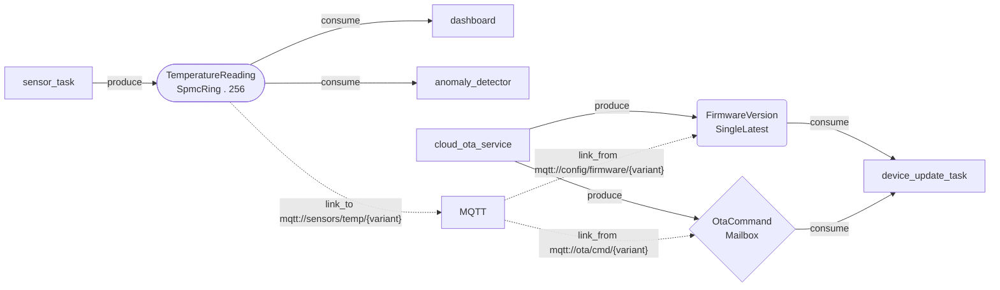

# Architecture Agent — Data-Driven Design Tooling

**Version:** 0.1
**Status:** 📋 Proposed
**Last Updated:** February 22, 2026
**Milestone:** M11 — Architecture Agent
**Depends On:** [009-M4-mcp-integration](009-M4-mcp-integration.md)

---

## Summary

Add a **conversational architecture agent** to AimDB's MCP server. A developer
describes a system in natural language; the agent reasons over it using AimDB's
buffer semantics; a running instance is derived as a direct consequence — with no
manual graph editing, no boilerplate, and no configuration the user has to set up
themselves.

The Mermaid diagram, the DSL, and the running instance are all **outputs** of
a conversation — not inputs to one.

**Core principle:** The graph is a **projection** — a read-only artifact that
reflects what was decided in conversation. The agent is the only thing that
writes to it.

---

## Motivation

Setting up an AimDB instance today requires writing Rust: defining `RecordKey`
enums, choosing buffer types, wiring connectors, configuring producers and
consumers. This is correct for production code, but it creates a barrier during
the ideation phase — the point where a developer is still figuring out *what*
the data architecture should be.

The architecture agent removes that barrier. It lets a developer think in terms
of data flows ("I have 50 sensors reporting temperature every 100ms, a dashboard
shows live readings, anomalies trigger alerts") and have the agent resolve those
flows into concrete AimDB primitives. The developer confirms each decision; the
agent emits the code.

---

## Core Principles

**Ideation first.** No user should ever touch a graph editor. The Mermaid
diagram, the DSL, and the running instance are all outputs of a conversation —
not inputs to one.

**Skills travel with the server.** Architecture agent capabilities are served by
the AimDB MCP server, not configured by the user. Connecting to the server is
the entire setup.

**The graph is a projection.** Mermaid is a read-only rendering of structured
agent state. It is useful for inspection and communication, never for authoring.

**Proposals, not silent commits.** Every record addition, buffer type choice, and
connector assignment is a proposal the human explicitly confirms. The graph is a
record of human intent, not agent inference.

**Ambiguity is resolved by questions, not assumptions.** When intent maps to
multiple valid architectures, the agent asks exactly the right question to
resolve it — grounded in AimDB's buffer semantics, not generic clarification.

---

## Architecture Overview

```
[ Human: natural language ideation ]
              |
[ Copilot + AimDB MCP: architecture agent ]
              |
[ Structured decision state: .aimdb/state.toml ]
              |
[ aimdb-codegen library (shared) ]----------.
              |                              |
              |  used by                     |  used by
              v                              v
[ aimdb-cli: `aimdb generate` ]    [ aimdb-mcp: on resolve_proposal ]
              |
              v
[ .aimdb/architecture.mermaid ]  [ src/generated_schema.rs ]
                                          |
                              [ cargo watch -> running instance ]
                                          |
                              [ AimX / MCP: live feedback ]
                                          ^
              ^---------------------------'
[ Agent surfaces conflicts and metrics inline ]
```

Every layer derives from the one above it. The human only ever interacts with
the top layer.

The **codegen library** (`aimdb-codegen`) is a pure Rust crate with no runtime
dependencies. It reads `state.toml` and emits Mermaid and Rust source files.
Both the CLI and the MCP server consume it — the CLI for standalone use
(`cargo watch`, CI, manual invocation) and the MCP server for inline generation
when a proposal is confirmed.

---

## Data Model Primitives

AimDB's three buffer types are the semantic vocabulary the agent reasons in.
Every architectural question resolves to one of these. These map directly to
`BufferCfg` in `aimdb-core/src/buffer/cfg.rs`.

| Buffer | `BufferCfg` variant | Pattern | When the agent chooses it |
|--------|-------------------|---------|--------------------------|
| **SpmcRing** | `SpmcRing { capacity }` | High-frequency stream, multiple independent consumers | Telemetry, interaction events, logs — data where every value matters and multiple systems read independently |
| **SingleLatest** | `SingleLatest` | Current state, newest value only | Configuration, experiment variants, UI state — data where only the present value is relevant |
| **Mailbox** | `Mailbox` | Command channel, latest wins, single slot | Device control, OTA commands, actuation — data where the latest instruction supersedes all prior ones |

These are not IoT-specific. They are universal primitives that underlie all
data-driven systems.

---

## Tooling Components

### 1. AimDB MCP Server — Extended

The existing MCP server (`tools/aimdb-mcp`) currently exposes 10 tools, a
dynamic set of resources (one static `aimdb://instances` plus per-instance
record resources), and 2 prompts for runtime introspection. The architecture agent
extends it with design-time capabilities.

#### New Tools

Agent-callable functions for reading and mutating the architecture state.

| Tool | Description |
|------|-------------|
| `get_architecture` | Current architecture graph as structured data from `state.toml` |
| `propose_change` | Add a record, modify a buffer type, add a connector — any mutation is a proposal pending human confirmation |
| `resolve_proposal` | Human acceptance (`confirm`), rejection (`reject`), or redirect (`revise`) — a single tool with an explicit status enum, not separate confirm/reject tools |
| `remove_record` | Propose removal of an existing record (cascades through Mermaid and codegen) |
| `rename_record` | Propose renaming a record (updates all references in `state.toml`, Mermaid, and codegen) |
| `validate_against_instance` | Check proposed `state.toml` against live instance via AimX |
| `get_buffer_metrics` | Live metrics for a given record key (delegates to existing `record_info` tool) |

**Why `resolve_proposal` instead of `confirm_proposal` / `reject_proposal`:**
A single tool with an explicit status enum (`confirm | reject | revise`)
prevents the agent from having to decide which tool to call based on parsing
ambiguous chat text like "sure, but...". The status is always unambiguous.

```rust
#[derive(Debug, Serialize, Deserialize)]
pub struct ResolveProposalParams {
    pub proposal_id: String,
    pub resolution: ProposalResolution,
    /// Optional redirect message when resolution is `revise`
    pub redirect: Option<String>,
}

#[derive(Debug, Serialize, Deserialize)]
#[serde(rename_all = "snake_case")]
pub enum ProposalResolution {
    Confirm,
    Reject,
    Revise,
}
```

#### New Resources

| URI | Description |
|-----|-------------|
| `aimdb://architecture` | Current architecture as Mermaid (generated from `state.toml`) |
| `aimdb://architecture/state` | Raw `state.toml` as structured data |
| `aimdb://architecture/conflicts` | Schema conflicts between `state.toml` and running instance |
| `aimdb://architecture/decisions` | Decision rationale log from `state.toml` |

These complement the existing resources (`discover`, `connections`,
`records/{socket}`, etc.) — they do not replace them.

#### New Prompts

| Prompt | Description |
|--------|-------------|
| `architecture_agent` | Full system prompt encoding AimDB design skills: buffer type semantics, question patterns, proposal format, confirmation protocol. Versioned alongside AimDB. |
| `resolve_buffer_type` | Disambiguation question patterns organised by data shape. Used by the agent to ask exactly the right question when intent is ambiguous. |
| `propose_record` | Structured template for record proposals. Ensures consistent format the human can quickly scan. |
| `breaking_change_review` | Safety protocol for schema evolution — what to check when a buffer type change or record removal could break the running instance. |
| `onboarding` | Guided first architecture session — walks the user through describing their system. |

The `architecture_agent` prompt is the core artifact. It encodes everything the
agent needs to reason about AimDB architectures. It is served by the MCP server
— when it improves, all connected users benefit without any local configuration
change.

---

### 2. Architecture Agent — Behaviour Spec

#### Startup

On session start, the agent:

1. Reads `aimdb://architecture/state` to load existing decisions
2. Reads `aimdb://architecture` to understand the current topology
3. Reads `aimdb://architecture/conflicts` to surface any drift between state
   and running instance
4. Briefly summarises the current architecture if one exists, or asks where to
   begin if not

#### Ideation Loop

```
Human describes intent (any form, any specificity)
    |
Agent identifies ambiguities that affect buffer type or topology
    |
Agent asks one targeted question (never multiple at once)
    |
Human responds
    |
Agent proposes a concrete record or topology change via propose_change
    |
Human confirms, rejects, or redirects via resolve_proposal
    |
On confirmation: agent updates state.toml, Mermaid regenerates, codegen emits
```

#### Ambiguity Resolution Patterns

The agent has a specific question for each common ambiguity. These questions are
not generic — each one resolves directly to a buffer type, topology, or data
model decision.

| Ambiguity | Agent asks | Resolves to |
|-----------|-----------|-------------|
| Read frequency unclear | "Does the consumer need every value, or just the latest at any given moment?" | `SpmcRing` vs `SingleLatest` |
| Consumer count unclear | "Is there one consumer for this data, or multiple independent ones?" | Topology (fan-out) |
| Direction unclear | "Does this flow from device to cloud, cloud to device, or both?" | `link_to` vs `link_from` |
| Cardinality unclear | "Is this one record shared across all devices, or one per device? Which specific devices?" | Concrete `key_variants` list |
| Buffering depth unclear | "If two values arrive before the consumer processes them, should the consumer see both, or only the latest?" | `SpmcRing` (both) vs `SingleLatest` / `Mailbox` (latest only) |
| Command vs state unclear | "Is this data passive state the consumer reads on demand, or an actionable command the consumer must process?" | `SingleLatest` (state) vs `Mailbox` (command) |
| Data model unclear | "Do you have a datasheet, API spec, or protocol doc I can look at for the field definitions?" | Value struct fields and types |

#### Data Model Derivation

The agent doesn't guess value types — it derives them from source material the
user provides:

- **Datasheets** — e.g. "SHT31 sensor" -> agent extracts calibrated temperature
  (f64 Celsius), humidity (f64 percent), reads the register map to understand
  which fields are meaningful at the application level
- **API documentation** — e.g. "firmware update REST API" -> agent extracts the
  response schema fields (version, checksum, release date)
- **Protocol specs** — e.g. "KNX DPT 9.001" -> agent maps the data point type
  to a Rust field type
- **Conversation** — when no formal spec exists, the agent asks targeted
  questions: "What fields does this reading contain? What units?"

The agent proposes the struct fields as part of the record proposal. The human
confirms the data model alongside the buffer type and topology.

#### Proposal Format

Every proposal follows a consistent structure the human can quickly scan:

```
Proposing: TemperatureReading

  Buffer:   SpmcRing(256)
  Reason:   Anomaly detector needs a sample window;
            dashboard consumes independently

  Value struct (derived from SHT31 datasheet):
    celsius:          f64    — Temperature in degrees Celsius
    humidity_percent: f64    — Relative humidity 0-100
    timestamp:        u64    — Unix timestamp in milliseconds

  Key prefix: "sensors.temp."
  Variants:   indoor, outdoor, garage

  Connector: mqtt link_to "mqtt://sensors/temp/{variant}"

  Produces: sensor_task
  Consumes: dashboard, anomaly_detector

Add this record? [confirm / reject / revise]
```

---

### 3. Structured Decision State

The agent maintains a structured state file at `.aimdb/state.toml`. This is the
memory layer — it persists across sessions and is the source of truth for both
the Mermaid projection and the Rust codegen.

#### Schema

```toml
# .aimdb/state.toml

[meta]
aimdb_version = "0.5.0"
created_at = "2026-02-22T14:00:00Z"
last_modified = "2026-02-22T14:33:00Z"

# --- Records ---

[[records]]
name = "TemperatureReading"
buffer = "SpmcRing"
capacity = 256
key_prefix = "sensors.temp."
key_variants = ["indoor", "outdoor", "garage"]
producers = ["sensor_task"]
consumers = ["dashboard", "anomaly_detector"]

  # Value schema — the agent derives this from datasheets, APIs, or conversation.
  # Codegen generates a Rust struct with these fields.
  [[records.fields]]
  name = "celsius"
  type = "f64"
  description = "Temperature in degrees Celsius"

  [[records.fields]]
  name = "humidity_percent"
  type = "f64"
  description = "Relative humidity 0-100"

  [[records.fields]]
  name = "timestamp"
  type = "u64"
  description = "Unix timestamp in milliseconds"

  [[records.connectors]]
  protocol = "mqtt"
  direction = "outbound"          # link_to
  url = "mqtt://sensors/temp/{variant}"

[[records]]
name = "FirmwareVersion"
buffer = "SingleLatest"
key_prefix = "device.firmware."
key_variants = ["gateway-01", "gateway-02", "sensor-hub-01"]
producers = ["cloud_ota_service"]
consumers = ["device_update_task"]

  [[records.fields]]
  name = "version"
  type = "String"
  description = "Semantic version string (e.g. 2.1.0)"

  [[records.fields]]
  name = "release_date"
  type = "String"
  description = "ISO 8601 date of the firmware release"

  [[records.fields]]
  name = "checksum"
  type = "String"
  description = "SHA-256 checksum of the firmware binary"

  [[records.connectors]]
  protocol = "mqtt"
  direction = "inbound"           # link_from
  url = "mqtt://config/firmware/{variant}"

[[records]]
name = "OtaCommand"
buffer = "Mailbox"
key_prefix = "device.ota."
key_variants = ["gateway-01", "gateway-02", "sensor-hub-01"]
producers = ["cloud_ota_service"]
consumers = ["device_update_task"]

  [[records.fields]]
  name = "action"
  type = "String"
  description = "Command action: 'update', 'rollback', 'reboot'"

  [[records.fields]]
  name = "target_version"
  type = "String"
  description = "Version to update to (for 'update' action)"

  [[records.connectors]]
  protocol = "mqtt"
  direction = "inbound"
  url = "mqtt://ota/cmd/{variant}"

# --- Decision Log ---

[[decisions]]
record = "TemperatureReading"
field = "buffer"
chosen = "SpmcRing"
alternative = "SingleLatest"
reason = "Anomaly detector needs a sample window; dashboard consumes independently"
timestamp = "2026-02-22T14:20:00Z"

[[decisions]]
record = "FirmwareVersion"
field = "buffer"
chosen = "SingleLatest"
alternative = "Mailbox"
reason = "Target version is state, not a command — only current target matters, not history of assignments"
timestamp = "2026-02-22T14:33:00Z"

[[decisions]]
record = "TemperatureReading"
field = "fields"
chosen = "celsius + humidity_percent + timestamp"
alternative = "raw ADC value"
reason = "User provided SHT31 datasheet — sensor outputs calibrated temperature and humidity, not raw ADC"
timestamp = "2026-02-22T14:15:00Z"
```

**Key design choice: all key variants are concrete and resolved by the agent.**

There is no `key_strategy` distinction. The agent's job during ideation is to
resolve the full set of variants — whether that's three rooms, fifty sensors,
or three devices. "One per device" is not a codegen concern; it is a
conversation the agent has with the human: "Which devices? What are their IDs?"

If the user says "one per device" without listing them, the agent asks: "Which
devices should I include? I need the concrete IDs for code generation." The
agent may also derive device lists from a fleet manifest, config file, or API
response the user provides.

**The `fields` table defines the value struct.** The agent derives this from
datasheets, API documentation, protocol specs, or conversation. Each record has
a typed struct — codegen generates the Rust `struct` with `Serialize` /
`Deserialize` derives. The agent decides which fields to include and what types
to use based on the source material.

**The `decisions` table** is the architectural rationale layer. The agent writes
to it on every confirmed proposal — including field-level decisions like "used
calibrated Celsius from the SHT31 datasheet rather than raw ADC values." It is
human-readable, diffable, and queryable by the agent to avoid re-litigating
settled decisions.

---

### 4. Mermaid Projection

The Mermaid file is generated, never authored. It lives at
`.aimdb/architecture.mermaid` and is regenerated by the codegen step on every
confirmed decision.

#### Conventions

Node shapes encode buffer type. Arrow styles encode data flow vs connector
metadata.



These conventions are defined in `.aimdb/CONVENTIONS.md` and referenced by the
`architecture_agent` prompt.

#### Properties

- Renders natively in GitHub markdown — no plugin, no server
- Read-only — never edited by the human
- Diffable — git history of `.aimdb/architecture.mermaid` is the history of
  architectural decisions
- Derivable — can always be regenerated from `state.toml`

---

### 5. Codegen Pipeline

#### Crate Structure

Codegen lives in a shared library crate (`aimdb-codegen`) consumed by both the
CLI and the MCP server:

```
aimdb/
  aimdb-codegen/                    # New crate: pure codegen library
    src/
      lib.rs                        # Public API: generate_mermaid(), generate_rust()
      state.rs                      # state.toml parser and schema types
      mermaid.rs                    # state.toml -> Mermaid renderer
      rust.rs                       # state.toml -> Rust source renderer
  tools/
    aimdb-cli/                      # Existing CLI — gains `aimdb generate` subcommand
      src/commands/generate.rs      # New: invokes aimdb-codegen library
    aimdb-mcp/                      # Existing MCP server — calls aimdb-codegen on confirm
```

**`aimdb-codegen` has no runtime dependencies.** It reads `state.toml` (via
`toml` + `serde`) and emits strings. No AimX connection, no async, no tokio.
This keeps it fast and testable.

**Two consumers:**

- **`aimdb generate`** (CLI) — The primary interface for developers and CI.
  Can be wired into `cargo watch -s "aimdb generate"`. Also usable standalone
  for one-shot generation, dry-run validation, or pre-commit hooks.
- **`aimdb-mcp`** (MCP server) — Calls `aimdb_codegen::generate_mermaid()` and
  `aimdb_codegen::generate_rust()` directly (library call, no subprocess) when
  `resolve_proposal` confirms a change. The MCP server writes the files and
  reports the result inline.

#### CLI Integration

The `aimdb generate` subcommand extends the existing CLI alongside `instance`,
`record`, `graph`, and `watch`:

```
aimdb generate [OPTIONS]

Options:
  --state <PATH>    Path to state.toml [default: .aimdb/state.toml]
  --mermaid <PATH>  Output path for Mermaid [default: .aimdb/architecture.mermaid]
  --rust <PATH>     Output path for Rust [default: src/generated_schema.rs]
  --check           Validate state.toml without writing files (for CI)
  --dry-run         Print generated output to stdout instead of writing files
```

`cargo watch` integration:

```bash
cargo watch -s "aimdb generate && cargo check"
```

#### Emit Targets

Two emit targets from `state.toml`:

**Mermaid** — written to `.aimdb/architecture.mermaid`

**AimDB Rust** — written to `src/generated_schema.rs`

The generated code uses the **actual AimDB API** — `#[derive(RecordKey)]` with
`#[key = "..."]`, `#[key_prefix = "..."]`, and `#[link_address = "..."]`
attributes; `AimDbBuilder` with `.configure()`, `BufferCfg`, `.link_to()`, and
`.link_from()`:

```rust
// Generated by aimdb-codegen — do not edit manually
// Source: .aimdb/state.toml — edit via architecture agent

use aimdb_core::buffer::BufferCfg;
use aimdb_derive::RecordKey;
use serde::{Serialize, Deserialize};

// --- TemperatureReading ---
// Buffer: SpmcRing(256)
// Decision: "Anomaly detector needs a sample window;
//            dashboard consumes independently"
// Fields derived from: SHT31 datasheet

/// Temperature and humidity reading from SHT31 sensor.
#[derive(Debug, Clone, Serialize, Deserialize)]
pub struct TemperatureReadingValue {
    /// Temperature in degrees Celsius
    pub celsius: f64,
    /// Relative humidity 0-100
    pub humidity_percent: f64,
    /// Unix timestamp in milliseconds
    pub timestamp: u64,
}

#[derive(RecordKey, Clone, Copy, PartialEq, Eq)]
#[key_prefix = "sensors.temp."]
pub enum TemperatureReadingKey {
    #[key = "indoor"]
    #[link_address = "mqtt://sensors/temp/indoor"]
    Indoor,

    #[key = "outdoor"]
    #[link_address = "mqtt://sensors/temp/outdoor"]
    Outdoor,

    #[key = "garage"]
    #[link_address = "mqtt://sensors/temp/garage"]
    Garage,
}

// --- FirmwareVersion ---
// Buffer: SingleLatest
// Decision: "Target version is state, not a command —
//            only current target matters"

/// Firmware version state for a device.
#[derive(Debug, Clone, Serialize, Deserialize)]
pub struct FirmwareVersionValue {
    /// Semantic version string (e.g. 2.1.0)
    pub version: String,
    /// ISO 8601 date of the firmware release
    pub release_date: String,
    /// SHA-256 checksum of the firmware binary
    pub checksum: String,
}

#[derive(RecordKey, Clone, Copy, PartialEq, Eq)]
#[key_prefix = "device.firmware."]
pub enum FirmwareVersionKey {
    #[key = "gateway-01"]
    #[link_address = "mqtt://config/firmware/gateway-01"]
    Gateway01,

    #[key = "gateway-02"]
    #[link_address = "mqtt://config/firmware/gateway-02"]
    Gateway02,

    #[key = "sensor-hub-01"]
    #[link_address = "mqtt://config/firmware/sensor-hub-01"]
    SensorHub01,
}

// --- OtaCommand ---
// Buffer: Mailbox

/// OTA command sent from cloud to a specific device.
#[derive(Debug, Clone, Serialize, Deserialize)]
pub struct OtaCommandValue {
    /// Command action: 'update', 'rollback', 'reboot'
    pub action: String,
    /// Version to update to (for 'update' action)
    pub target_version: String,
}

#[derive(RecordKey, Clone, Copy, PartialEq, Eq)]
#[key_prefix = "device.ota."]
pub enum OtaCommandKey {
    #[key = "gateway-01"]
    #[link_address = "mqtt://ota/cmd/gateway-01"]
    Gateway01,

    #[key = "gateway-02"]
    #[link_address = "mqtt://ota/cmd/gateway-02"]
    Gateway02,

    #[key = "sensor-hub-01"]
    #[link_address = "mqtt://ota/cmd/sensor-hub-01"]
    SensorHub01,
}
```

A separate `configure_schema` function wires the records into an `AimDbBuilder`:

```rust
use aimdb_core::builder::AimDbBuilder;
use aimdb_core::buffer::BufferCfg;
use aimdb_executor::Spawn;

/// Register all architecture-agent-defined records on the builder.
///
/// This function is generated from .aimdb/state.toml. It configures
/// buffer types and connectors. Producers and consumers (source/tap
/// closures) must be provided by application code — they are not
/// generated because they contain business logic.
pub fn configure_schema<R: Spawn + 'static>(
    builder: &mut AimDbBuilder<R>,
) {
    // TemperatureReading — SpmcRing(256), outbound MQTT
    for key in [
        TemperatureReadingKey::Indoor,
        TemperatureReadingKey::Outdoor,
        TemperatureReadingKey::Garage,
    ] {
        builder.configure::<TemperatureReadingValue>(key, |reg| {
            reg.buffer_cfg(BufferCfg::SpmcRing { capacity: 256 });
            if let Some(addr) = key.link_address() {
                reg.link_to(addr)
                    // Serializer must be provided by application code
                    ;
            }
        });
    }

    // FirmwareVersion — SingleLatest, inbound MQTT
    for key in [
        FirmwareVersionKey::Gateway01,
        FirmwareVersionKey::Gateway02,
        FirmwareVersionKey::SensorHub01,
    ] {
        builder.configure::<FirmwareVersionValue>(key, |reg| {
            reg.buffer_cfg(BufferCfg::SingleLatest);
            if let Some(addr) = key.link_address() {
                reg.link_from(addr)
                    // Deserializer must be provided by application code
                    ;
            }
        });
    }

    // OtaCommand — Mailbox, inbound MQTT
    for key in [
        OtaCommandKey::Gateway01,
        OtaCommandKey::Gateway02,
        OtaCommandKey::SensorHub01,
    ] {
        builder.configure::<OtaCommandValue>(key, |reg| {
            reg.buffer_cfg(BufferCfg::Mailbox);
            if let Some(addr) = key.link_address() {
                reg.link_from(addr)
                    ;
            }
        });
    }
}
```

**What codegen generates per record:**

1. A **value struct** (`TemperatureReadingValue`) with `Serialize` /
   `Deserialize` derives — fields and types come from `records.fields` in
   `state.toml`
2. A **key enum** (`TemperatureReadingKey`) with `#[derive(RecordKey)]` — one
   variant per entry in `key_variants`
3. A **registration block** in `configure_schema` — wires buffer type,
   connectors, and the correct value type `T`

**What codegen does NOT generate:** Producer closures (`source`/`source_raw`),
consumer closures (`tap`/`tap_raw`), serializers, deserializers, and transform
pipelines. These contain business logic that belongs in application code. The
generated `configure_schema` provides the skeleton; the developer fills in the
behaviour.

`cargo watch` picks up the change. The running instance updates. The AimDB MCP
server reflects the new state. The agent reads it back and surfaces any
conflicts inline.

---

### 6. Conflict Detection

The `aimdb://architecture/conflicts` resource compares `state.toml` against the
running instance (via AimX `record.list`). Conflicts are categorised:

| Conflict type | Description | Severity |
|---------------|-------------|----------|
| **missing_in_instance** | Record exists in `state.toml` but not in running instance | Warning — codegen may not have run yet |
| **missing_in_state** | Record exists in running instance but not in `state.toml` | Info — manually registered record, not agent-managed |
| **buffer_mismatch** | `state.toml` says `SpmcRing` but instance reports `single_latest` | Error — likely a stale build |
| **capacity_mismatch** | `state.toml` says capacity 256 but instance reports 1024 | Warning — may be intentional override |
| **connector_mismatch** | Connector URL in `state.toml` doesn't match instance metadata | Warning |

The agent surfaces conflicts on startup and before confirming any proposal that
touches an affected record. It does **not** attempt automatic remediation —
conflicts are reported inline and the human decides what to do.

---

### 7. Record Deletion and Renaming

The ideation loop covers adding records and changing buffer types. It must also
handle removal and renaming.

#### Deletion

When the user says "remove TemperatureReading":

1. Agent proposes deletion via `remove_record` tool
2. Proposal includes: affected consumers, affected connectors, and a warning if
   the record exists in the running instance
3. On confirmation: record is removed from `state.toml`, Mermaid regenerates,
   `src/generated_schema.rs` regenerates (the enum and its `configure_schema`
   block are removed)
4. **Application code that references the deleted type will fail to compile.**
   This is intentional — the compiler catches dangling references. The agent
   notes this in the proposal.

#### Renaming

When the user says "rename TemperatureReading to SensorReading":

1. Agent proposes rename via `rename_record` tool
2. On confirmation: all references in `state.toml` are updated (including in
   `decisions` entries), Mermaid regenerates, codegen regenerates with new
   enum name
3. **Application code that references the old type will fail to compile.**
   Same rationale as deletion — the compiler is the migration tool.

Both operations add a `decisions` entry recording what was removed/renamed and
why.

---

### 8. VS Code Integration

The VS Code surface is thin by design. It does not add a graph editor. It does
not add a canvas. It adds three things:

**Status bar indicator** — shows whether the running instance is in sync with
`state.toml`. Green = in sync. Orange = codegen pending. Red = schema conflict
detected. This is a minimal VS Code extension that reads
`aimdb://architecture/conflicts` on a timer.

**Mermaid preview** — VS Code's built-in Mermaid support (or the Markdown
Preview Mermaid extension) renders `.aimdb/architecture.mermaid` automatically.
No custom panel needed.

**MCP connection** — the user adds one entry to their VS Code MCP config:

```json
{
  "mcpServers": {
    "aimdb": {
      "command": "aimdb-mcp",
      "args": ["--connect", "localhost:7777"]
    }
  }
}
```

Everything else — the agent skills, the prompt, the tools, the resources —
arrives from the server. The user configuration is one JSON block. That is the
entire setup.

---

## User Experience

### First Session

```
User connects MCP server -> Copilot loads architecture_agent prompt

Agent: No architecture found. Tell me about the system you're building —
       what data exists, where it comes from, and where it needs to go.

User: I have 3 SHT31 sensors (indoor, outdoor, garage) reporting every 100ms.
      A dashboard shows live readings. Anomalies trigger cloud alerts.

Agent: I know the SHT31 — it outputs calibrated temperature and relative
       humidity. One question:
       Does the dashboard need every reading, or just the current
       value per sensor?

User: Just the current value is fine.

Agent: Proposing: TemperatureReading

         Buffer:   SingleLatest
         Reason:   Dashboard reads current value only — no
                   need to buffer historical samples

         Value struct (from SHT31 datasheet):
           celsius:          f64  — Temperature in degrees Celsius
           humidity_percent: f64  — Relative humidity 0-100
           timestamp:        u64  — Unix timestamp in milliseconds

         Key prefix: "sensors.temp."
         Variants:   indoor, outdoor, garage

         Connector:  mqtt link_to "mqtt://sensors/temp/{variant}"
         Consumers:  dashboard, anomaly_detector

       Add this record? [confirm / reject / revise]

User: Yes, but I think we might need history for the anomaly detection.

Agent: Good catch. If anomaly detection needs a window of readings
       rather than just the latest, SpmcRing is the right choice —
       it buffers the last N values for independent consumption.

       Revised proposal: TemperatureReading

         Buffer:   SpmcRing(256)
         Reason:   Anomaly detector needs a sample window;
                   dashboard consumes independently

       Value struct and key variants unchanged. This means the dashboard
       will always have the latest reading as well.

       Add this record? [confirm / reject / revise]

User: Yes.

-> state.toml updated (record + fields + decision log)
-> .aimdb/architecture.mermaid regenerated
-> src/generated_schema.rs regenerated
     (TemperatureReadingValue struct + TemperatureReadingKey enum
      + configure_schema block)
-> cargo watch triggers rebuild
-> Running instance reflects new record
-> MCP metrics endpoint live for TemperatureReading
```

### Ongoing Sessions

The agent loads prior state on startup. Existing decisions are not re-litigated
unless the human explicitly revisits them. The `decisions` table gives the agent
the rationale for prior choices, so it can explain them and reason about whether
a new requirement changes them.

---

## Implementation

### Phase 1 — Prompt Engineering (no code required)

Define the agent's reasoning capabilities as MCP prompts. Validate through
manual ideation sessions before building any infrastructure.

| Task | Output |
|------|--------|
| Define `.aimdb/CONVENTIONS.md` — Mermaid node shapes and arrow types | Static file |
| Write `architecture_agent` system prompt | MCP prompt |
| Write `resolve_buffer_type` disambiguation question patterns | MCP prompt |
| Write `propose_record` proposal template | MCP prompt |
| Write `breaking_change_review` safety protocol | MCP prompt |
| Write `onboarding` guided session prompt | MCP prompt |
| **Validate**: run ideation sessions manually using Claude or Copilot with the prompts as context. Identify gaps before building anything. | Session transcripts |

**Exit criteria:** Three end-to-end ideation sessions produce correct buffer
type selections and Mermaid output without the agent making incorrect
assumptions.

### Phase 2 — `aimdb-codegen` Library

Create the shared codegen crate. This is a pure library with no async or
runtime dependencies — just `toml`, `serde`, and string formatting.

| Task | Scope |
|------|-------|
| Create `aimdb-codegen` crate with `state.toml` parser (`state.rs`) | Schema types + TOML deserialization (including `records.fields`) |
| Implement `generate_mermaid(state: &ArchitectureState) -> String` | ~150 lines |
| Implement `generate_rust(state: &ArchitectureState) -> String` | ~400 lines (value structs + key enums + `configure_schema`) |
| Add `validate(state: &ArchitectureState) -> Vec<ValidationError>` | Key uniqueness, field type validity, buffer config, connector URLs |
| Integration test: generated Rust compiles against `aimdb-core` 0.5.0 API | Compile-time test |

The codegen generates three things per record: a **value struct** (from
`records.fields`) with `Serialize` / `Deserialize` derives, a **key enum**
(from `key_variants`) using `#[derive(RecordKey)]` with `#[key = "..."]`,
`#[key_prefix = "..."]`, and `#[link_address = "..."]` attributes, and a
**registration block** in `configure_schema` using `AimDbBuilder::configure()`
with the correct `BufferCfg`, `link_to()`, and `link_from()`.

**Supported field types in `records.fields`:** `f64`, `f32`, `u8`, `u16`,
`u32`, `u64`, `i8`, `i16`, `i32`, `i64`, `bool`, `String`. The agent maps
source material (datasheet registers, API response fields, protocol data point
types) to these Rust primitives.

**Key validation:** The generated `RecordKey` enums must pass the derive macro's
compile-time checks — unit variants only, all variants have `#[key = "..."]`,
no duplicate keys.

### Phase 3 — CLI `generate` Subcommand

Add `aimdb generate` to the existing CLI. This is the primary developer-facing
interface for codegen.

| Task | Scope |
|------|-------|
| Add `aimdb-codegen` dependency to `aimdb-cli/Cargo.toml` | Dependency |
| Implement `commands/generate.rs` — read `state.toml`, call codegen, write files | ~80 lines |
| Add `--check` mode for CI validation (exit 1 if files would change) | Flag |
| Add `--dry-run` mode (print to stdout) | Flag |
| Document `cargo watch -s "aimdb generate && cargo check"` pattern | README |

This phase can ship independently of the MCP server extension — developers
get value from `aimdb generate` even without the architecture agent.

### Phase 4 — MCP Server Extension

| Task | Scope |
|------|-------|
| Add `aimdb-codegen` dependency to `aimdb-mcp/Cargo.toml` | Dependency |
| Add `propose_change`, `resolve_proposal`, `remove_record`, `rename_record` tools | `tools/aimdb-mcp/src/tools/architecture.rs` |
| Wire `resolve_proposal` confirm path to call `aimdb_codegen::generate_*()` | Library call (no subprocess) |
| Add `validate_against_instance` tool using existing AimX `record.list` | `tools/aimdb-mcp/src/tools/architecture.rs` |
| Add `aimdb://architecture/*` resources | `tools/aimdb-mcp/src/resources/architecture.rs` |
| Add all 5 new prompts to MCP prompts manifest | `tools/aimdb-mcp/src/prompts/` |
| Implement conflict detection (compare `state.toml` vs AimX `record.list`) | `tools/aimdb-mcp/src/architecture/conflicts.rs` |

### Phase 5 — VS Code Polish

| Task | Scope |
|------|-------|
| Status bar extension (sync indicator: green/orange/red) | Minimal VS Code extension |
| Confirm Mermaid preview works via existing VS Code extensions | Documentation |
| Document the single MCP config block as the complete setup step | README update |

---

## Resolved Decisions

1. **State file location** — **`.aimdb/state.toml`**. The hidden directory keeps
   the repo root clean. Discoverability is addressed by documenting the path in
   the README and surfacing it in agent startup messages.

2. **Confirmation UX** — **Inline chat confirmation via `resolve_proposal`
   tool.** A single tool with a `confirm | reject | revise` status enum. Keeps
   the entire ideation flow in one surface with no UI context switches. A VS
   Code quick-pick was considered but adds no value for this pattern.

3. **Breaking change handling** — **Warn, do not block, do not propose
   migrations automatically.** When a proposed change is incompatible with the
   running instance, the agent surfaces the conflict inline and halts the
   proposal. Migration paths are only explored if the user explicitly asks.

4. **Multi-instance support** — **Single instance only.** The MCP server
   connects to exactly one running AimDB instance. Fleet and per-device keying
   patterns are out of scope for this version.

5. **Prompt injection strategy** — **Slash command ships first.** The
   `architecture_agent` prompt is loaded explicitly (e.g. via `/aimdb`).
   Automatic injection on session start via MCP Prompts is deferred until VS
   Code Copilot's support for that pattern matures.

6. **All key variants are concrete** — There is no `key_strategy` distinction.
   The agent resolves the full set of concrete variants during conversation.
   "One per device" is not a codegen abstraction — it is a question the agent
   asks: "Which devices? What are their IDs?" The agent may derive device
   lists from fleet manifests, config files, or API responses. Codegen always
   receives a flat list of string variants and generates one enum variant per
   entry.

7. **Record deletion/renaming** — **Supported. Compiler catches dangling
   references.** When a record is removed or renamed, the generated code
   changes. Application code that references the old type fails to compile.
   The agent notes this in the proposal. No automatic migration of application
   code.

8. **Codegen language and location** — **Rust, in a shared `aimdb-codegen`
   crate.** Keeps the toolchain unified, enables both `aimdb generate` (CLI)
   and MCP server to use the same library. The CLI already depends on
   `aimdb-core` and `aimdb-client`, so adding a codegen crate is consistent
   with the existing workspace structure. Phase 3 (CLI) can ship independently
   of Phase 4 (MCP), giving developers value earlier.

9. **Value types are agent-defined structs** — The agent derives the value
   struct from source material: datasheets, API docs, protocol specs, or
   conversation. `state.toml` stores the full field list (`records.fields`)
   with name, Rust type, and description. Codegen generates a Rust struct with
   `Serialize` / `Deserialize` derives and uses it as the `T` in
   `builder.configure::<T>()`. No placeholder types, no generic parameters —
   the struct is fully specified.

---

## Success Criteria

The tooling is working when:

- A developer can describe a multi-record system in plain language and have a
  compiling, correctly-typed AimDB schema in under 10 minutes
- The `.aimdb/architecture.mermaid` file accurately reflects every architectural
  decision with no manual maintenance
- A new team member can understand the system's data architecture by reading the
  Mermaid graph and the `decisions` table, without reading any application code
- Changing a buffer type or adding a connector is a one-sentence conversation,
  not a code change
- Generated code compiles against the actual `aimdb-core` 0.5.0 API without
  modification

---

## References

- [009-M4-mcp-integration](009-M4-mcp-integration.md) — Existing MCP server
  design
- [003-M1_buffer_usage_guide](003-M1_buffer_usage_guide.md) — Buffer type
  selection guide
- [016-M6-record-key-trait](016-M6-record-key-trait.md) — `RecordKey` trait and
  derive macro
- [018-M7-dynamic-mqtt-topics](018-M7-dynamic-mqtt-topics.md) — Dynamic
  connector routing
- [021-M9-graph-introspection](021-M9-graph-introspection.md) — Dependency
  graph API
