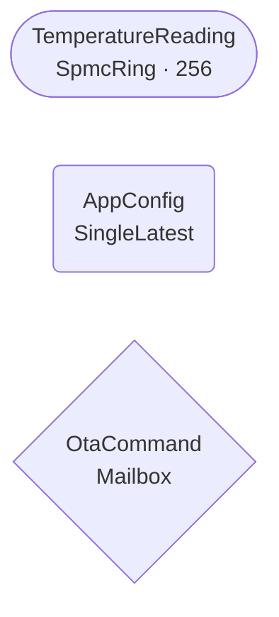
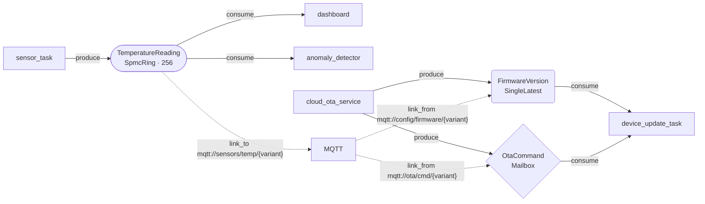

# AimDB Architecture Diagram Conventions

This file defines the visual language used in `.aimdb/architecture.mermaid`.
It is referenced by the `architecture_agent` MCP prompt.
**Do not edit the Mermaid file directly** — it is generated from `.aimdb/state.toml`.

---

## Node Shapes — Buffer Type Encoding

Each buffer type maps to a specific Mermaid node shape so the topology is
readable at a glance.

| Buffer Type | Mermaid Shape Syntax | Rendered Shape | When Used |
|-------------|---------------------|---------------|-----------|
| `SpmcRing` | `(["Name\nSpmcRing · capacity"])` | Stadium / pill | High-frequency streams; every sample matters; multiple independent consumers |
| `SingleLatest` | `("Name\nSingleLatest")` | Rounded rectangle | Current state; only newest value relevant; config, UI state |
| `Mailbox` | `{"Name\nMailbox"}` | Diamond / rhombus | Command channel; latest instruction supersedes prior; actuation |

### Examples

---

## Arrow Styles — Data Flow vs Connector Metadata

Two arrow styles distinguish internal data flow from external connector wiring.

| Style | Syntax | Meaning |
|-------|--------|---------|
| Solid arrow | `A -->|label| B` | Data flow: producer writes, consumer reads |
| Dashed arrow | `A -.->|label| B` | Connector metadata: `link_to` or `link_from` |

### Solid Arrow Labels

| Label | Meaning |
|-------|---------|
| `produce` | A task writes values into the record |
| `consume` | A task reads values from the record |

### Dashed Arrow Labels

Dashed arrows connect records to a shared `MQTT`, `KNX`, or other connector node.
The label contains the direction and URL template.

| Label format | Meaning |
|--------------|---------|
| `"link_to mqtt://topic/{variant}"` | DB → broker (outbound publish) |
| `"link_from mqtt://topic/{variant}"` | Broker → DB (inbound subscribe) |
| `"link_to knx://..."` | DB → KNX bus |
| `"link_from knx://..."` | KNX bus → DB |

---

## Full Example

---

## Rules

1. **Records only** appear as shaped nodes. Producers and consumers appear as
   plain rectangular nodes (default Mermaid style — no shape override).
2. **Connector buses** (`MQTT`, `KNX`, etc.) appear as plain nodes, connected
   to records via dashed arrows only.
3. **Node labels** always include the record name on the first line and the
   buffer type (with capacity for SpmcRing) on the second line, separated by
   `\n`.
4. **Key variants** are NOT shown individually in the diagram. The record node
   represents the entire key family. Variant-specific URLs appear in dashed
   arrow labels using `{variant}` placeholder notation.
5. **Decision rationale** is NOT embedded in the diagram. It lives in the
   `[[decisions]]` table in `state.toml` and is queryable via the
   `aimdb://architecture/decisions` MCP resource.
6. The diagram is **always regenerated** from `state.toml` — never edited by
   hand. Run `aimdb generate` or confirm a proposal via the architecture agent.
